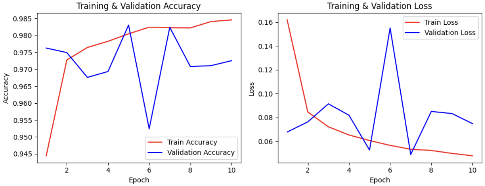

# 📝 Penjelasan Proyek
Proyek ini merupakan sistem klasifikasi gambar jenis beras menggunakan pendekatan deep learning dan transfer learning berbasis arsitektur MobileNetV2. Tujuannya adalah untuk mengembangkan model yang mampu mengidentifikasi dan mengklasifikasikan lima jenis beras, yaitu:

* Arborio
* Basmati
* Ipsala
* Jasmine
* Karacadag

Model ini dilatih menggunakan dataset gambar beras dengan resolusi yang telah diseragamkan serta melalui proses augmentasi, normalisasi, dan rescaling untuk meningkatkan performa dan generalisasi model.

## 📂 Dataset
Dataset yang digunakan dalam proyek ini berasal dari situs resmi milik Murat Koklu:

🔗 https://www.muratkoklu.com/datasets/

Dataset tersebut berisi gambar dari lima jenis beras yang telah diberi label dengan baik. Data ini digunakan untuk pelatihan dan pengujian model klasifikasi citra berbasis CNN.
Distribusi jumlah gambar pada masing-masing kelas:

| Label                         | Counts           |
|-------------------------------|------------------|
| Arborio                       | 15000            |
| Jasmine                       | 15000            |
| Basmati                       | 15000            |
| Karacadag                     | 15000            |
| Ipsala                        | 15000            |
| **Total**                     | **75000**        |

## 🖼️ Preview Images

# 📈 Evaluasi Model
## 🧠
1.  MobileNetV2 sebagai Backbone Feature Extractor
    - Menggunakan arsitektur **MobileNetV2** yang telah dilatih pada dataset **ImageNet**.
    - Bagian top classification dihapus (`include_top=False`) dan input disesuaikan menjadi `(150, 150, 3)`.
    - **Seluruh layer dibekukan** (`layer.trainable=False`) agar bobot pretrained tidak diubah selama training.

2.  Layer Tambahan
    - `Conv2D(48, (3, 3), activation='relu', padding='same')`: Menambahkan konvolusi pertama dengan padding dan aktivasi ReLU.
    - `MaxPooling2D(pool_size=(2, 2))`: Mengurangi dimensi spasial untuk fitur hasil Conv2D.
    - `Conv2D(96, (3, 3), activation='relu', padding='same')`: Layer konvolusi kedua untuk memperdalam ekstraksi fitur.
    - `MaxPooling2D(pool_size=(2, 2))`: Pooling tambahan untuk menurunkan resolusi spasial dan mempercepat komputasi.
    - `Flatten()`: Mengubah output 2D dari pooling menjadi vektor 1D untuk input ke dense layer.
    - `Dropout(0.4)`: Mengurangi overfitting dengan membuang 40% neuron secara acak selama training.
    - `Dense(128, activation='relu')`: Fully connected layer untuk belajar representasi akhir dari fitur-fitur yang telah diekstrak.
    - `Dense(5, activation='softmax')`: Output layer dengan 5 neuron, merepresentasikan 5 kelas beras.

3. Proses Kompilasi dan Pelatihan
    - **Optimizer**: Adam dengan learning rate `1e-4`.
    - **Loss Function**: `categorical_crossentropy` (karena merupakan klasifikasi multi-kelas).
    - **Metrik Evaluasi**: `accuracy`.
    - **Callbacks**:
      - `ModelCheckpoint`: Menyimpan model terbaik berdasarkan nilai `val_loss` terendah.
      - `EarlyStopping`: Menghentikan pelatihan lebih awal jika `val_loss` tidak membaik selama 5 epoch berturut-turut (dengan `min_delta=0.001`).

## 📊 Grafik Akurasi dan Loss

| Epoch | Akurasi      | Loss   | Val Akurasi | Val Loss |
|-------|--------------|--------|-------------|----------|
| 1     | 0.8914       | 0.3033 | 0.9763      | 0.0677   |
| 2     | 0.9722       | 0.0873 | 0.9749      | 0.0762   | 
| 3     | 0.9749       | 0.0764 | 0.9676      | 0.0914   | 
| 4     | 0.9772       | 0.0687 | 0.9693      | 0.0819   | 
| 5     | 0.9812       | 0.0577 | 0.9831      | 0.0526   | 
| 6     | 0.9828       | 0.0566 | 0.9524      | 0.1551   |
| 7     | 0.9805       | 0.0579 | 0.9824      | 0.0489   | 
| 8     | 0.9816       | 0.0541 | 0.9708      | 0.0850   |
| 9     | 0.9833       | 0.0519 | 0.9711      | 0.0833   |
| 10    | 0.9842       | 0.0511 | 0.9725      | 0.0748   |

## 🔍 Hasil Prediksi Model Rice Classification

| No. | File Path                                                  | Label Sebenarnya | Hasil Prediksi | Prediksi Benar |
|-----|-------------------------------------------------------------|------------------|----------------|----------------|
| 1   | `Rice_Image_Dataset/Jasmine/Jasmine (7775).jpg`            | Jasmine          | Jasmine        | ✅              |
| 2   | `Rice_Image_Dataset/Basmati/basmati (12991).jpg`           | Basmati          | Basmati        | ✅              |
| 3   | `Rice_Image_Dataset/Karacadag/Karacadag (12533).jpg`       | Karacadag        | Karacadag      | ✅              |
| 4   | `Rice_Image_Dataset/Ipsala/Ipsala (9752).jpg`              | Ipsala           | Ipsala         | ✅              |
| 5   | `Rice_Image_Dataset/Arborio/Arborio (5266).jpg`            | Arborio          | Arborio        | ✅              |